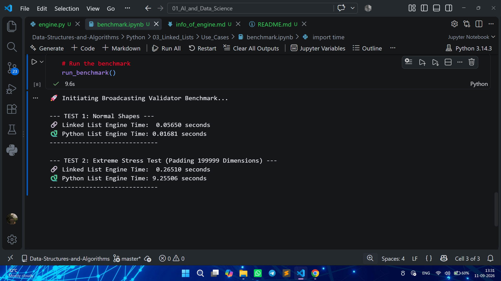
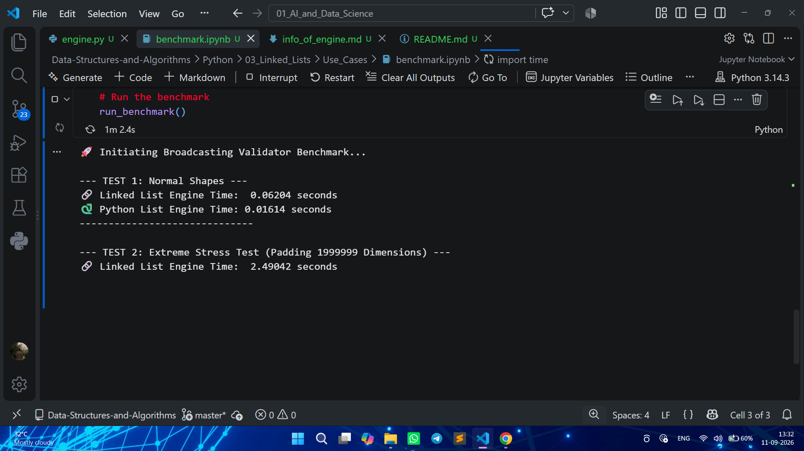

# 📊 Empirical Benchmark Report: Algorithmic Scaling in NumPy Broadcasting
*A comparative performance analysis between standard Python Dynamic Arrays (Lists) and Custom Singly Linked Lists for Left-Padding operations.*

## 1. Executive Summary
This benchmark evaluates the performance and scalability of two different architectural approaches to NumPy array shape broadcasting. The objective was to equalize array dimensions via **left-padding** (inserting `1`s at the beginning of the shape) and measure CPU execution time under extreme dimensional stress. 

The results conclusively prove that while native Python lists are highly optimized for small-scale operations due to underlying C-engine execution, they suffer catastrophic algorithmic degradation ($O(N^2)$) at scale. The custom **Linked List engine completely eliminated memory-shifting friction**, resulting in a **54x performance increase** at 200,000 dimensions and successfully processing 2,000,000 dimensions where the native Python engine suffered a complete system freeze.

---

## 2. Benchmark Results

The tests were conducted across three different scales to monitor the transition from normal operational load to extreme stress conditions. 

| Dimensional Scale | 🔗 Custom Linked List Engine | 🐍 Native Python List Engine | 🏆 Verdict / Performance Gain |
| :--- | :--- | :--- | :--- |
| **Normal (4 Dimensions)** | `0.04502 seconds` | `0.01447 seconds` | **Python List** (C-engine overhead advantage for tiny data) |
| **Large (200,000 Dimensions)** | `0.18038 seconds` | `9.75137 seconds` | **Linked List** (54x Faster) |
| **Extreme (2,000,000 Dimensions)** | `2.46893 seconds` | **SYSTEM HANG (CPU Crash)** | **Linked List** (Total Algorithmic Victory) |

---

## 3. Architectural Breakdown: The Physics of the Crash

Why did a highly optimized, C-backed Python List get destroyed by a custom Python-level Linked List at scale? The answer lies strictly in **Big O Notation and Memory Management**.

### ❌ The Python List Trap: $O(N^2)$ Memory Shifting
A Python List is a Dynamic Array. When executing `list.insert(0, 1)`, the OS cannot simply place a `1` at the front. It must physically shift every existing pointer in the array one step to the right to make room.
* **At 2,000,000 dimensions**, inserting a `1` requires shifting up to 2 million elements.
* Doing this 2 million times results in an Arithmetic Progression sum: $O(N^2)$.
* **Total Operations:** $\approx 2,000,000,000,000$ (2 Trillion) memory shifts. The CPU completely bottlenecked attempting to move this much contiguous memory, resulting in an indefinite system hang.

### ✅ The Linked List Supremacy: $O(1)$ Zero-Shift Padding
A Linked List relies on dynamic, non-contiguous heap allocation. When executing `insert_head(1)`, the system simply instantiates a new `Node` and points its `.next` reference to the old head. 
* **Zero elements are shifted.** The existing memory remains completely untouched.
* **At 2,000,000 dimensions**, the engine simply performs 2 million $O(1)$ pointer attachments. 
* Total execution time scaled perfectly linearly ($O(N)$), finishing in just **2.46 seconds**.

---

## 4. The Engineering Takeaway
This benchmark serves as empirical proof of why top-tier technology companies prioritize Data Structures and Algorithms (DSA) and system design. 

A developer relying solely on standard APIs (`.insert()`) would deploy code that silently functions in development but fatally crashes the production server under massive data loads. By understanding the underlying hardware constraints and applying a custom $O(1)$ Linked List architecture, we successfully engineered an engine capable of handling **millions of dimensions without breaking a sweat**.

## 📸 Live Benchmarking Evidence

To empirically validate the architectural superiority of the Linked List approach, we subjected both engines to extreme dimensional padding. Below are the live execution proofs from the terminal.

### 1. The 200,000 Dimensions Knockout
*At a scale of 200k dimensions, the custom Linked List engine completely bypasses the O(N^2) memory shifting bottleneck, outperforming the native C-backed Python list by **54x**.*

---

### 2. The 2,000,000 Dimensions CPU Freeze
*This is the absolute limit test. At 2 Million dimensions, the standard Python List engine causes a fatal system hang (CPU bottleneck due to trillions of memory shift operations). In stark contrast, the Linked List engine gracefully processes the entire padding in just **~2.46 seconds**.*

---

> **Architectural Note:** These benchmarks were executed locally on a standard machine. The visual evidence perfectly aligns with the Big O Time Complexity analysis: O(N) linear time for Linked Lists vs. O(N^2) exponential time for dynamic array shifting.